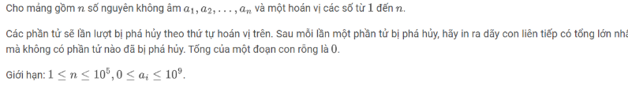
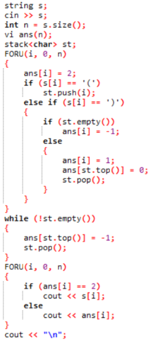
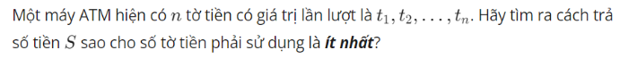

# Quy hoạch động

1. Đồng xu(Cái túi)

```python
n, S = map(int, input().split())
w = list(map(int, input().split()))
dp = [0] * (S + 1)
dp[0] = 0

for i in range(1, S+1):
    dp[i] = min(dp[i-x] for x in w if x <= i) + 1

print(dp)
print(dp[S])
```

2. Xâu con chung dài nhất 

```python
n1, n2 = map(int, input().split())
s1, s2 = input().split()
t = [[0] * (len(s2) + 1) for _ in range(len(s1) + 1)]

for i, x1 in enumerate(s1, 1):
    for j, x2 in enumerate(s2, 1):
        if x1 == x2:
            t[i][j] = t[i - 1][j - 1] +1
        else:
            t[i][j] = max(t[i][j - 1], t[i - 1][j])
print(t[-1][-1])
```
3. Palindrome(chèn kí tự để được xâu đối xứng)


4. Chia đa giác(min đường chéo)


5. Đặt ngoặc => max biểu thức 


6. Prefix-sum trên mảng 2 chiều 


7. Hình chữ nhật 0-1 

```C++
for (int i = 1; i <= m; i++) f[1][i] = 1;
for (int i = 1; i <= n; i++) f[i][1] = 1;

for (int i = 2; i <= n; i++) 
    for (int j = 2; j <= m; j++) {
        if (a[i][j] == a[i-1][j] && a[i][j] == a[i][j-1] && a[i][j] == a[i-1][j-1]) f[i][j] = min(f[i-1][j], min(f[i][j-1], f[i-1]j-1)) + 1;
        else f[i][j] = 1;
        ans = max(ans, f[i][j]);
    }
```

8. Dãy con tăng dài nhất

```C++
f[1] = 1;
int res = 1;
for (int i = 2; i <= n; i++) {
    int l = 1, r = res, j = 0;
    while (l <= r) {
        int m = (l+r)/2;
        if (a[i] > a[f[m]]) {
            j = m;
            l = m+1;
        } else r = m-1;
    }
    if (j == res) f[++res] = i;
    if (a[i] < a[f[j+1]]) f[j+1] = i;
}

cout << res;
```

# Tree

1. Segment Tree


```C++
int n, q;
int a[maxN];
long long st[4 * maxN];

void update(int id, int l, int r, int i, int val) {
    if (l > i || r < i) return;
    if (l == r) {
        st[id] = val;
        return;
    }

    int mid = l + r >> 1;
    update(2 * id, l, mid, i, val);
    update(2 * id + 1, mid + 1, r, i, val);
    st[id] = st[2 * id] + st[2 * id + 1];
}

long long get(int id, int l, int r, int u, int v) {
    if (l > v || r < u) return 0;
    if (l >= u && r <= v) return st[id];

    int mid = l + r >> 1;
    long long get1 = get(2 * id, l, mid, u, v);
    long long get2 = get(2 * id + 1, mid + 1, r, u, v);
    return get1 + get2;
}
int main() {
    cin >> n >> q;
    while (q -- ){
        int type, x, y;
        cin >> type >> x >> y;
        if (type == 1) update(1, 1, n, x, y);
        else cout << get(1, 1, n, x, y) << '\n';
    }
}
```


```C++
struct node {
    int pre, suf, sum, maxsum;

    static node base() { return { -inf, -inf, 0, -inf }; }

    // Hàm cập nhật 2 nút con
    static node merge(const node& a, const node& b) {
        node res;
        res.pre = max(a.pre, b.pre + a.sum);
        res.suf = max(b.suf, a.suf + b.sum);
        res.sum = a.sum + b.sum;
        res.maxsum = max(a.maxsum, b.maxsum);
        res.maxsum = max(res.maxsum, a.suf + b.pre);
        return res;
    }
};

int n, m;
int a[maxN];
node st[4 * maxN] ;

void build(int id, int l ,int r) {
    if (l == r) {
        st[id] = { a[l], a[l], a[l], a[l] };
        return;
    }
    int mid = l + r >> 1;
    build(2 * id, l, mid);
    build(2 * id + 1, mid + 1, r);
    st[id] = node :: merge(st[2 * id], st[2 * id + 1]);
}

node get(int id, int l, int r, int u, int v){
    if (l > v || r < u) return node::base();
    if (l >= u && r <= v) return st[id];

    int mid = l + r >> 1;
    node g1 = get(2 * id, l, mid, u, v);
    node g2 = get(2 * id + 1, mid + 1, r, u, v);
    return node::merge(g1, g2);
}

int main() {
    cin >> n;
    for (int i = 1; i <= n; ++i) cin >> a[i];
    build(1, 1, n);

    cin >> m;
    while (m -- ) {
        int x, y;
        cin >> x >> y;
        cout << get(1, 1, n, x, y).maxsum << '\n';
    }
}
```


```C++
int n, m;
int a[maxN];
multiset <int> st[4 * maxN];

void build(int id, int l, int r) {
    if (l == r) {
        st[id].insert(a[l]);
        return;
    }

    int mid = l + r >> 1;
    build(2 * id, l, mid);
    build(2 * id + 1, mid + 1, r);

    st[id] = st[2 * id + 1];
    for (auto x : st[2 * id]) st[id].insert(x);
}

void update(int id, int l, int r, int i, int old, int val) {
    if (l > i || r < i) return;
    if (l == r) {
        st[id].clear();
        st[id].insert(val);
        return;
    }
    int mid = l + r >> 1;
    update(2 * id, l, mid, i, old, val);
    update(2 * id + 1, mid + 1, r, i, old, val);
    st[id].erase(st[id].find(old));
    st[id].insert(val);
}

int get(int id, int l, int r, int u, int v, int k) {
    if (l > v || r < u) return inf;
    if (l >= u && r <= v) {
        auto it = st[id].lower_bound(k);
        if (it == st[id].end()) return inf;
        return *it;
    }

    int mid = l + r >> 1;
    int get1 = get(2 * id, l, mid, u, v, k);
    int get2 = get(2 * id + 1, mid + 1, r, u, v, k);
    return min(get1, get2);
}

int main() {
    cin >> n >> m;
    for (int i = 1; i <= n; ++i) cin >> a[i];
    build(1, 1, n);

    while (m -- ){
        int type, l, r, k;
        cin >> type;
        if (type == 1) {
            cin >> l >> k;
            update(1, 1, n, l, a[l], k);
            a[l] = k;
        }
        else {
            cin >> l >> r >> k;
            int ans = get(1, 1, n, l, r, k);
            cout << ((ans == inf) ? -1 : ans) << '\n';
        }
    }
}
```

2. Lazy Update


```C++
int n, q;
int a[maxN];
long long st[4 * maxN], lazy[4 * maxN];

void build(int id, int l, int r) {
    if (l == r) {
        st[id] = a[l];
        return;
    }
    int mid = l + r >> 1;
    build(2 * id, l, mid);
    build(2 * id + 1, mid + 1, r);
    st[id] = max(st[2 * id], st[2 * id + 1]);
}

void fix(int id, int l, int r) {
    if (!lazy[id]) return;
    st[id] += lazy[id];

    if (l != r){
        lazy[2 * id] += lazy[id];
        lazy[2 * id + 1] += lazy[id];
    }
    lazy[id] = 0;
}


void update(int id, int l, int r, int u, int v, int val) {
    fix(id, l, r);
    if (l > v || r < u) return;
    if (l >= u && r <= v) {
        lazy[id] += val;
        fix(id, l, r);
        return;
    }

    int mid = l + r >> 1;
    update(2 * id, l, mid, u, v, val);
    update(2 * id + 1, mid + 1, r, u, v, val);
    st[id] = max(st[2 * id], st[2 * id + 1]);
}

long long get(int id, int l, int r, int u, int v) {
    fix(id, l, r);
    if (l > v || r < u) return -inf;
    if (l >= u && r <= v) return st[id];

    int mid = l + r >> 1;
    long long get1 = get(2 * id, l, mid, u, v);
    long long get2 = get(2 * id + 1, mid + 1, r, u, v);
    return max(get1, get2);
}

int main() {
    cin >> n;
    for (int i = 1; i <= n; ++i) cin >> a[i];
    build(1, 1, n);

    cin >> q;
    while (q--) {
        int type, l, r, val;
        cin >> type >> l >> r;
        if (type == 1) {
            cin >> val;
            update(1, 1, n, l, r, val);
        }
        else cout << get(1, 1, n, l, r) << '\n';
    }
}

```


# Graph
1. DSU



2. Liên thông mạnh


3. Liệt kê cạnh cầu


4. Dijkstra


5. Bellmand-Ford


6. Kruskal


7. Floyd


8. Chu trình, đường đi
Euler:

Halminton:


# Số học
1.Phi Hàm Euler là số lượng các số từ 1 đến n nguyên tố cùng nhau với n


2. Tính phần dư trong giai thừa rút gọn


3. Hợp nhất các đoạn thẳng
Bài toán
Cho n đoạn thẳng trên đường thẳng, đoạn thứ i có tọa độ các điểm đầu và cuối là
ai, bi. Hãy tính độ dài của hợp các đoạn đã cho.

Lưu tất cả các tọa độ vào mảng x,
Với mỗi phần tử của x: đánh dấu là điểm đầu hay điểm cuối của đoạn thẳng,
Sắp xếp x theo thứ tự tăng dần, với các điểm cùng tọa độ – ưu tiên điểm đầu,
Sử dụng bộ đếm c thống kê số lượng đoạn thẳng giao nhau,
Duyệt mảng x, nếu c ≠ 0: cộng thêm vào kết quả hiệu xi – xi-1, nếu gặp điểm đầu – tăng c lên 1, gặp điểm cuối – giảm c.


4. Diện tích đa giác không thứ tự cắt


5. Tập điểm phủ của các đoạn thẳng
Cho n đoạn thẳng trên đường thẳng, đoạn thứ i có tọa độ các điểm đầu và cuối là ai, bi. Hãy xác định số lượng ít nhất các điểm cần chọn để mỗi đoạn thẳng đã cho chứa ít nhất một điểm trong số đã chọn.


6. Bao lồi
Cho n điểm trên mặt phẳng, điểm thứ i có tọa độ (xi, yi). Hãy xác định bao lồi (hay nói cách khác – xác định đa giác lồi nhỏ nhất) chứa các điểm đã cho .


7. Cặp điểm gần nhất


8. Dãy Catalan


9. Tam giác Pascal


10. Số Fibonacci


# Stack
1. Cây dừa (Tìm hình chữ nhật lớn nhất)


2. Hình chữ nhật


3. Hậu tố, tiền tố, trung tố


Trung tố sang hậu tố:


Tiền tố sang trung tố:


Khác:



# Sinh
1. Sinh NP

2. Sinh TH


# Quay lui nhánh cận
1. Người đi du lịch


2. ATM



# BIT
```C++
b.count(): Đếm số lượng bit có giá trị 1.
b.size(): Kích thước của bitset (số lượng bit).
b.set(pos, value): Đặt giá trị của bit tại vị trí pos thành value (0 hoặc 1).
b.flip(): Đảo tất cả các bit.
b.test(pos): Kiểm tra bit tại vị trí pos.
b.any(): Trả về true nếu có ít nhất 1 bit là 1.
b.none(): Trả về true nếu tất cả các bit đều bằng 0.
std::popcount(x): Đếm số bit có giá trị 1 trong số x.
std::countl_zero(x): Đếm số lượng bit 0 từ trái sang phải (từ đầu dãy bit).
std::countr_zero(x): Đếm số lượng bit 0 từ phải sang trái (từ cuối dãy bit).
std::has_single_bit(x): Kiểm tra nếu x là lũy thừa của 2.
std::bit_ceil(x): Trả về số nhỏ nhất là lũy thừa của 2 và lớn hơn hoặc bằng x.
std::bit_floor(x): Trả về số lớn nhất là lũy thừa của 2 và nhỏ hơn hoặc bằng x.
std::rotl(x, n): Quay trái (rotate left) x một lượng n bit.
std::rotr(x, n): Quay phải (rotate right) x một lượng n bit.
__builtin_popcount(x): Hàm đếm số bit 1 trong số x. Hàm này thường có trên các trình biên dịch GCC.
__builtin_clz(x): Đếm số bit 0 từ đầu dãy bit.
__builtin_ctz(x): Đếm số bit 0 từ cuối dãy bit.
```